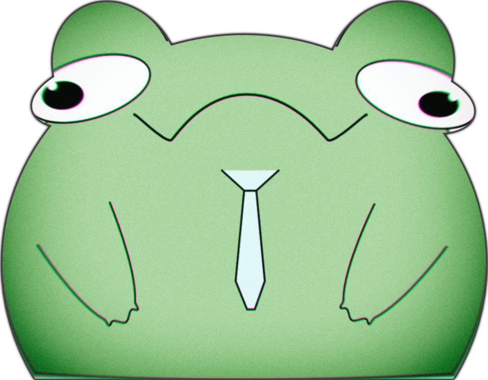

# AnnoFrog

[](https://github.com/niklasries/AnnoFrog)

A GUI desktop application for semi-automated 2D human pose annotation in videos, using bounding box and keypoint labeling, AI-assisted suggestions (PoseViT for detection, RTMO for keypoints), and interpolation tools. Built with Python, PyQt6, and OpenGL.

## Features

*   **Video Loading & Frame Navigation:** Load common video formats (MP4, AVI, MOV, MKV) and easily navigate frames using a visual timeline or keyboard shortcuts.
*   **Bounding Box Annotation:**
    *   Manually draw bounding boxes around subjects.
    *   Adjust bounding box corners.
*   **Keypoint Annotation (14-Point Human Pose):**
    *   Place keypoints for Left/Right Shoulders, Elbows, Wrists, Hips, Knees, Ankles, Head, and Neck.
    *   Mark keypoints as Visible, Occluded.
    *   Visual skeleton rendering.
*   **AI-Assisted Annotation:**
    *   **Bounding Box Detection (PoseViT):**
        *   Utilizes a PoseViT-based model for pose estimation of a set of BBoxes.
    *   **Keypoint Pose Estimation (RTMO):**
        *   Utilizes the RTMO model (via `rtmlib`) for automatic keypoint pose suggestions.
        *   Configurable confidence thresholds.
        *   Modes:
            *   Suggest poses for all detected people.
            *   Suggest poses only for user-drawn/PoseViT-suggested bounding boxes.
*   **Interpolation Tools:**
    *   Generate linear interpolation suggestions for keypoints and bounding boxes between manually annotated frames.
    *   Configurable maximum gap for interpolation.
    *   Auto-interpolation mode to fill gaps across all tracks.
    *   Accept or discard individual or all suggestions.
*   **Annotation Management:**
    *   Save and load annotations in JSON format (associated with the video file).
    *   Manage multiple person instances per frame with unique IDs.
    *   Change person IDs globally (with conflict resolution/swapping) or locally for a single frame.
    *   Mark person tracks as "Done" to lock them from further editing.
    *   Globally hide/show specific person tracks to reduce clutter.
    *   Delete annotations for specific IDs and frame ranges.
*   **Interactive Canvas:**
    *   OpenGL-accelerated rendering for smooth zooming and panning of the annotation display.
    *   Context-sensitive cursors and status messages.
*   **User Interface:**
    *   Organized layout with dedicated panels for AI, Interpolation, and Deletion tools.
    *   List of annotated persons per frame with interaction options (select, edit, context menu).
    *   Clickable timeline for quick frame navigation.

## Requirements

*   Python 3.9+, torch > 2.0
*   See `requirements.txt` for specific Python package dependencies.
*   An NVIDIA GPU with CUDA support is highly recommended for AI pose estimation (`rtmlib` with `DEVICE = 'cuda'`). CPU mode is available but will be significantly slower.
*   Pre-trained AI Models:
    *   RTMO ONNX model (e.g., `RTMO-body7-crowdpose.onnx`). *You need to provide this model.*
    *   PoseViT model for bounding box detection. Will auto Download

## Installation & Setup

1.  **Clone the repository:**
    ```bash
    git clone https://github.com/niklasries/AnnoFrog.git
    cd AnnoFrog
    ```

2.  **Create and activate a virtual environment (recommended):**
    ```bash
    python -m venv venv
    ```

3.  **Install dependencies:**
    ```bash
    pip install -r requirements.txt
    ```

4.  **Obtain AI Models:**
    *   **RTMO (Keypoints):**
        *   Download a pre-trained RTMO model (e.g., from [OpenMMLab's RTMO project](https://github.com/open-mmlab/mmpose/tree/main/projects/rtmo)). For example, the `.pth` file for [RTMO-l](https://download.openmmlab.com/mmpose/v1/projects/rtmo/rtmo-l_16xb16-700e_body7-crowdpose-640x640-5bafdc11_20231219.pth).
        *   Convert the downloaded `.pth` model to ONNX format (e.g., `RTMO-body7-crowdpose.onnx`). Refer to MMPose or RTMLib documentation for conversion scripts.
        *   Place the converted ONNX model in a directory like `res/models/`.
    *   **PoseViT (Bounding Boxes):**
        *   As ViTPose needs bounding boxes, it only works if you give it a suggestion. The Head and Neck Keypoints are not returned as it is N17 COCO, so only 12 of those keypoints get shown.

5.  **Configure Model Paths:**
    *   Open the Python script `Window.py` (or your main application configuration file).
    *   Locate the following lines and update the paths to your downloaded/converted ONNX models:
        ```python
        RTMO_CROWDPOSE_MODEL_PATH = 'res/models/your_rtmo_model.onnx' # Update this path
        ```
    *   You can also configure the `DEVICE` (e.g., `'cuda'` or `'cpu'`) if needed.

## Usage

1.  **Run the application:**
    ```bash
    python Annofrog.py
    ```

2.  **Load Video:** Use "File" > "Load Video..." to open a video file.
3.  **Annotation Modes:**
    *   **Select/Idle (Esc):** Default mode. Click to select existing annotations. Double-click a keypoint or person in the list to enter edit mode.
    *   **New BBox (B):** Click on the canvas to define the top-left and bottom-right corners of a new bounding box. You'll then enter keypoint placement mode for this new person.
4.  **Placing Keypoints:**
    *   When a person is active for editing:
        *   **Left-Click:** Place the current keypoint as "Visible" or start dragging an existing keypoint.
        *   **Right-Click:** Place the current keypoint as "Occluded" or change an existing visible keypoint to occluded.
        *   **Middle-Click on Keypoint:** Delete the keypoint.
        *   **Q/E Keys:** Cycle to the previous/next keypoint to place.
        *   **Enter Key:** Finalize keypoint placement for the current person and return to Idle mode (person remains selected).
5.  **AI-Assisted Annotation:**
    *   Use the "AI Tools" panel (or similar name).
    *   *(You might want to specify how PoseViT is triggered for BBox detection, e.g., a button or automatic on frame load)*
    *   For RTMO keypoints: Click "Run AI on Current Frame (V)" or similar button to get suggestions.
    *   Adjust confidence and target mode as needed.
    *   AI suggestions appear and can be accepted (e.g., by double-clicking them or via context menu).
6.  **Interpolation:**
    *   Use the "Interpolation Tools" panel.
    *   Select an active person (who has at least two keyframes).
    *   Click "Generate Next Suggestion" or enable "Auto-Interpolation".
    *   Accept or discard suggestions.
7.  **Managing IDs:**
    *   The "Annotated IDs" list on the right shows persons on the current frame.
    *   **Single-click:** Selects the person on the canvas.
    *   **Double-click:** Activates the person for editing (or accepts suggestion).
    *   **Right-click:** Opens a context menu for actions like:
        *   Changing ID (globally or locally for the frame).
        *   Deleting the person from the current frame.
        *   Marking the person track as "Done".
        *   Globally Hiding/Showing the person.
        *   Accepting/Discarding suggestions.
8.  **Navigation:**
    *   **A/D Keys:** Previous/Next frame.
    *   **J Key:** Jump to a specific frame number.
    *   **Timeline:** Click on thumbnails to jump to frames.
    *   **Mouse Wheel:** Zoom in/out on the canvas.
    *   **Middle-Click + Drag:** Pan the canvas.
9.  **Saving:**
    *   Annotations are typically saved automatically after significant actions.
    *   "File" > "Save Annos (Force)" (Ctrl+S) for an explicit save.
    *   Annotation files (`_annotations.json`) are saved next to the video file.

## Key Bindings Summary

*   **A:** Previous Frame
*   **D:** Next Frame
*   **J:** Jump to Frame
*   **V:** Run AI Pose Estimation (RTMO Keypoints) on Current Frame
*   **Spacebar:** Accept all (interpolated) suggestions on current frame
*   **Esc:** Enter Idle/Select mode, deselect active person, or cancel current drawing action.
*   **B:** Toggle "New BBox" mode.
*   **Enter (in Keypoint Mode):** Finalize keypoints for the active person.
*   **Q (in Keypoint Mode):** Select previous keypoint to place/edit.
*   **E (in Keypoint Mode):** Select next keypoint to place/edit.
*   **Ctrl+L:** Load Video
*   **Ctrl+R:** Reset Canvas View
*   **Ctrl+S:** Force Save Annotations
*   **Ctrl+Q:** Exit Application

## Known Issues / Future Work

**Known Issues:**

*   **Performance with Long Videos:** Global operations (like global ID changes or initial auto-interpolation on very long videos) might experience performance slowdowns.

**Resolved Issues (Recently Fixed):**

*   ~~**Bounding Box Interpolation:** Interpolation of bounding box corners between keyframes is not currently implemented or fully functional.~~ (Now implemented)
*   ~~**AI Suggestion Display with Existing BBox:** When using the AI "Only for Empty User BBoxes" mode, AI-generated keypoint suggestions might not immediately display or update visually if a user-drawn bounding box already exists for that person ID. Deleting and re-adding the user bbox or toggling the AI mode might be needed as a workaround.~~ (Fixed)
*   ~~**Tooltip in Keypoint Mode:** After all keypoints for a person are set and the user returns to an "Idle" state with that person selected, the tooltip near the cursor might still display information about the last placed keypoint instead of a general "Idle" or selection message.~~ (Fixed)

**Future Work:**

*   **VidPredViT Training Data Generation:** The primary goal for this tool is to generate high-quality annotated data for training a custom Video Prediction Vision Transformer (VidPredViT) model, specifically tailored for robust motion tracking and prediction of human poses in video sequences.
*   **Model Management:** Allow users to select different AI pose estimation models or configure model-specific parameters through the UI more easily (e.g., without editing code).
*   **Batch Processing:** Add capabilities for batch processing videos or running AI/interpolation tasks in the background for multiple files.

## License

